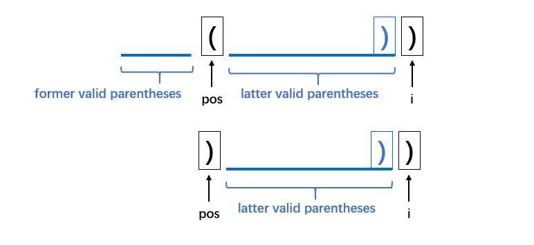
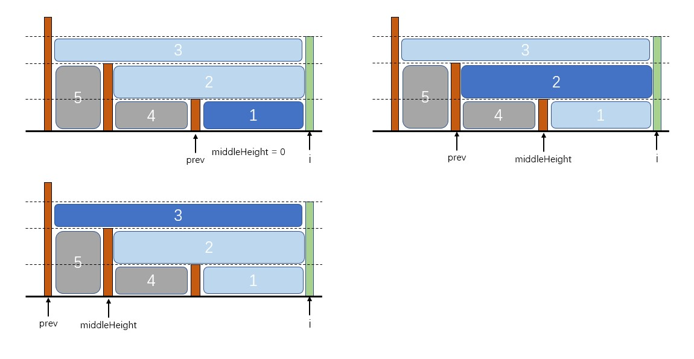

# Dynamic Programming

## Tree

### Kill Process

**source:** leetcode: https://leetcode-cn.com/problems/kill-process/

**solution:**

- **KillProcessFind:** use find method in UnionFind to search the parent and record along the trace. We use array to record each node, but when we use `Arrays.fill()`, `indexOf`, which will take `2*n` time complexity. 

- **KillProcessRDFS:** build map tree and DFS.

- **KillProcessRBFS:** like KillProcessRDFS, but do BFS.

## String Matching

### String matching

**source:** https://leetcode-cn.com/problems/wildcard-matching/

**solution:**

- use the board table:

- fill the grids, line by line. conditions in code.
- yellow grid need to be filled in advance.
- the right bottom is the final result.

### Regular Expression Matching

**source**: https://leetcode-cn.com/problems/regular-expression-matching/

**solution**:

- use the board table 

- fill the grids, line by line. conditions in code.
- the right bottom is the final result.

## Array

### Longest Valid Parentheses

**source**: https://leetcode-cn.com/problems/longest-valid-parentheses/

**solution**:

- we have a `dp[len]` to record the longest valid parentheses ending with the current position.

- check`string[i]` and `string[i-1]`, details in the code:

  - if `string[i] == '('` ,then `dp[i] = 0`;

  - else when `string[i] == ')'`

    - if `string[i-1] == '('`, `dp[i] = dp[i-2] + 2`
    - if `string[i-1] == ')'`, when need to find `pos` and then do further work.

    

### Trapping Rain Water

**source**: https://leetcode-cn.com/problems/trapping-rain-water/

**solution**: 

- use `int[] leftMax` to record the max value of `[0, i]` and `int[] rightMax` to record the max value of `[i, height.length]`
- `leftMax[i] = max(leftMax[i-1], height[i])`
- `rightMax[i] = max(rightMax[i-1], height[i])`

# Tree

## Binary Tree

### Traversal

#### Binary Tree In-order Traversal:

**source:** https://leetcode-cn.com/problems/binary-tree-inorder-traversal/

**solution:**

- use stack, very similar to pre-order

#### Binary Tree Pre-order Traversal:

**source:** https://leetcode-cn.com/problems/binary-tree-preorder-traversal/

**solution:**

- use stack, very similar to in-order traversal

#### Binary Tree Post-order Traversal:

**source:** https://leetcode-cn.com/problems/binary-tree-postorder-traversal/

**solution:**

- use two stacks, the upper stack stores the child nodes that need to be traversed, the lower stack store the nodes in a reversed order

#### Binary Tree Level Order Traversal:

**source:** https://leetcode-cn.com/problems/binary-tree-level-order-traversal/

**solution**

- stuff nodes into two queues alternatively.

# Monotone Stack

Use monotone stack to solve the question: next greater element.

### Trapping Rain Water

**source**: https://leetcode-cn.com/problems/trapping-rain-water/

**solutions**:

- use monotone stack to record previous greater element.
- we have an `int[] height`, if `height[i] >= height[stack.peek()]`, accumulate water and pop the top out, until the stack is empty or the top element in the stack is larger than `height[i]`.
- 
  - accumulate water chunk from 1 to 3, pay attention: chunk 4 and chunk 5 needn't to be considered when traverse the green column.
