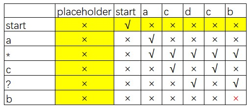
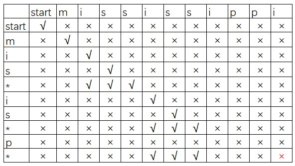

# Dynamic Programming

## Tree

### Kill Process

**source:** leetcode: https://leetcode-cn.com/problems/kill-process/

**solution:**

- **KillProcessFind:** use find method in UnionFind to search the parent and record along the trace. We use array to record each node, but when we use `Arrays.fill()`, `indexOf`, which will take `2*n` time complexity. 

- **KillProcessRDFS:** build map tree and DFS.

- **KillProcessRBFS:** like KillProcessRDFS, but do BFS.

## String Matching

### String matching

**source:** https://leetcode-cn.com/problems/wildcard-matching/

**solution:**

- use the board table:

- fill the grids, line by line. conditions in code.
- yellow grid need to be filled in advance.
- the right bottom is the final result.

### Regular Expression Matching

**source**: https://leetcode-cn.com/problems/regular-expression-matching/

**solution**:

- use the board table 

- fill the grids, line by line. conditions in code.
- the right bottom is the final result.

